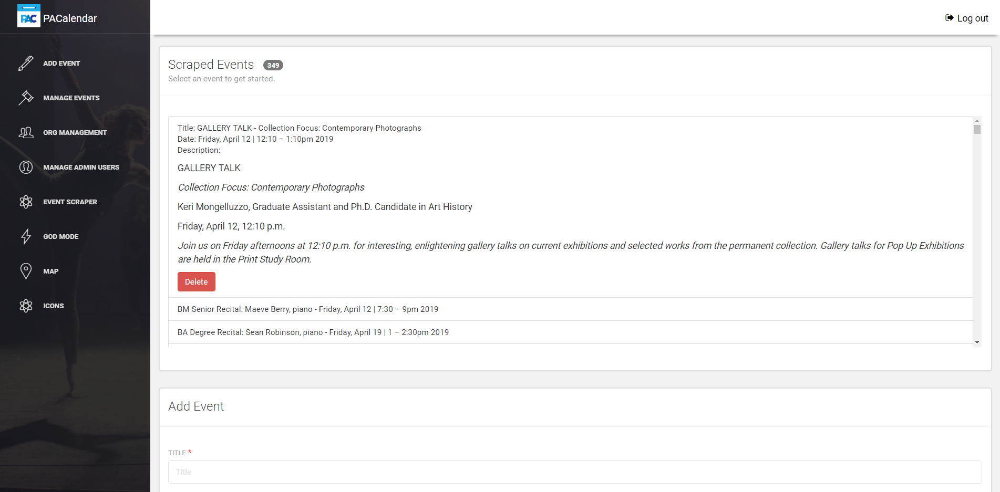

# PACalendar Admin Dashboard Project Summary

Throughout 2018, I worked with the Performing Arts Council at the Pennsylvania State University to develop the first centralized calendar for the visual and performing arts around the University Park campus. Prior to this app’s creation, various entities such as the Penn State School of Music, School of Theatre, and the Center for the Performing Arts utilized separate calendars for the promotion of events to students, staff, and community members. With their information spread across various locations, many opportunities for cross promotion and user-discovery of events were missed. 

Our vision was to engage a larger portion of our university with the diverse and growing Penn State arts community. The project was conceptualized and executed from the ground up by students Marissa Works, Anthony Stem and me.
To accomplish this goal, the system pooled information from several disparate calendars and compiled them into a single data set. The system architecture I developed consisted of the following components:

Mobile App - Web Scraper - API

These components worked together to create a fully functional calendar system utilized across the university. In addition to the organizations whose information was automatically pooled, the creation of this website enabled additional arts organizations to submit their events for publication on the calendar with the approval of designated student administrators.

## Dashboard

The dashboard served to give key insights to the student leaders and administrators that utilized the administrative dashboard to manage the in-app events. Besides displaying the user information anonymously (collected at the time of initial mobile app account creation), it also showed the summary of approved in-app events. From this page the leaders were able to gauge their marketing campaigns over the term of this app's lifecycle and played a key role when showing administrators how much use the app was getting.

## Adding an Event

With most applications, there should be a way to input content for the users to view. We found that for this use case, the best option was to create an event form that would act as the validator for the system's data structure and integrity. This form (created with a combination of Bootstrap, Redux Forms, and React-Datetime) validated the inputted data before allowing it to enter the approval process. The data required was tailored for a performing arts event, including ticket details, ticket costs, and of course the location of the event. Every app must start with a strong foundation and after the second iteration of the web application, this was the base that the app needed to be built on top of. 

## Editing an Event

We found that calendar content unfortunately becomes outdated or obsolete very quickly. The requirement to edit and manage events by changing an event’s location, time, or even existence became necessary soon after the creation page was implemented. The following functionality displays the edit form and redux form's potential to be reusable across many use cases. The same form that was used to add was also leveraged for editing. The only modification required was the injection of different buttons with their respective functions.

## Organizations

Organizations were necessary to manage the events of each user group. Events from all the organizations were pooled into the mobile app but all the events around campus would be too much for one student to enter in their free-time. I considered that these same students I was giving administrative access to were typically also student leaders of those organizations and already had plenty to do outside of the classroom. To effectively maintain this, I decided to create a hierarchical structure that encompassed the entire app’s permissions. Organizations were a way to group non-administrative users and limit their access in both the user page and the event creation page through permission-based feature flags.

## Adding an Organization

The application required a page to create and manage the organizations mentioned above. To do this, I developed the Organization page (also a combination of Bootstrap and Redux-Forms). This page validated that each organization had a name and a category or genre attached to it and optionally allowed them to even upload their own pictures to be used as an in-app avatar.

## Editing an Organization

Along with creation always comes the need for edit functionality when something goes wrong...

## Users

Lower in the administrative hierarchy, but almost more important, were the web users. These were the student leaders that volunteered to represent their organizations in this application, their responsibility was to create and submit all their organization's calendar year events to be displayed in the mobile application.

## Adding a User

The application required a function to add users to a pre-existing organization or as an administrator. To do this, I developed another Redux Form styled with Bootstrap. I used an input field selector to only open the organizations multi-select when a user was not an administrator. Every time a user was created through this form, a request was dispatched to the API to send the user an email that would prompt them to set up a password.

## Editing a User

Similar to adding a user, this form validates the exact same information as the add form does but in addition, it dispatches an email letting the user know that their permissions had changed and what exactly the change was.

## The Event Scraper

The Event Scraper was the centerpiece of this project and something I implemented right from the start. When I was initially approached by Anthony Stem, I thought that the Penn State just needed a mobile app front end for all their event data (boy was I wrong). Penn State already had a few event calendars hosted for the Center for Performing Arts and various other student organizations to use. The approach I took was to scrape the events using a web scraper directly from Penn State’s calendar host, 25Live. By using this innovative method, I mitigated any risk of requiring access to Penn State’s databases. The Web Scraper I developed can be found on my profile. What it does is rip all the data from static HTML files using “cheerio,” a NodeJS plugin. From here I condense the events and place them next to the event creation form (in the Web Scraper route) to be viewed for approval by an administrator. The event scraper was a lot of fun to write as it's a "Dockerized" NodeJS process that runs every half hour dispatching over 700 requests (1 for each calendar day on a two-year rolling basis), to 25Live. The scraper does this in an "undetectable", rate-limited fashion that condenses the events into a single dataset which (when compared to the preexisting events) was either used to create an event or was tossed.

## God Mode

To enable a super user to bypass the approval process to the event database, I developed an access point for them to make immediate changes. While this was rarely used, it was nice to know if there ever was an issue with an event’s content such as a last-minute change of location or time, administrators could edit the event. 

